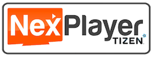
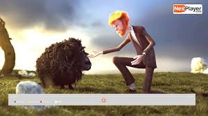

# NexPlayer SDK for TizenTV Sample App.

This repository contains a sample application that demonstrates the capabilities of the [NexPlayer SDK for TizenTV ](https://www.nexstreaming.com/products/nexplayer-for-tizen) and is provided for developer educational purposes. To build your own application, you must use the NexPlayer SDK.

## NexPlayer for Tizen TV.

NexPlayer for Tizen, a player SDK for Tizen-based apps, allowing video service providers to make their apps work on the popular Samsung Smart TVs with the highest video quality and the most advanced features set. With the launch of this product, NexPlayer technology is available now for Samsung Tizen Smart TVs, Android STBs, Android phones and tablets, iOS and Android TVs.

## Features
- Easy to integrate into any Tizen-based    Samsung Smart TV app.

- HLS, MPEG-DASH & Smooth Streaming live streaming

- Subtitles & Close-captioning: CEA608, VTT, TTML, SMI, SRT...

- DRM support: Playready

- Reuse your Tizen streams for your HTML-5 browser apps

- CMAF

- 24/7 personalized technical support

## Development Requirements

- **[NexPlayerSDK for TizenTV ver 0.9.6](https://www.nexstreaming.com/products/nexplayer-for-tizen)  or later**

- **[Tizen TV Extension Image 3.0.2](http://developer.samsung.com/tv/develop/tools/tv-extension/download)** or later.
- **[Tizen Studio v1.2.0](http://developer.samsung.com/tv/develop/tools/tizen-studio/)** or later.

     **PLEASE NOTE:** The NexPlayer SDK for Tizen library necessary to build this app is not provided with this sample code. To receive a free trial copy of the SDK, please fill out the **[NexPlayer SDK trial signup form](https://www.nexstreaming.com/products/nexplayer-for-tizen)** to be sent a link where you can download the SDK along with a free trial license key.

## How To use.

* [Nexplayer SDK for Tiezn TV  Developer Documentation](https://github.com/Nexstreaming/nexplayer-sdk-samples-tizenTV/blob/master/documents/tutorial/HowToUse.md)

## Additional resources

* [Nexplayer SDK for Tiezn TV Release Notes](https://github.com/Nexstreaming/nexplayer-sdk-samples-tizenTV/blob/master/documents/overview/ReleaseNotes.md)

* [Nexplayer SDK for Tiezn TV Product Specification](https://github.com/Nexstreaming/nexplayer-sdk-samples-tizenTV/blob/master/documents/overview/Specification.md)

* [Nexplayer SDK for Tiezn TV Product Page](https://www.nexstreaming.com/products/nexplayer-for-tizen)

## Contact
[NexPlayer SDK]( http://www.nexplayersdk.com)

## License

* [Nexplayer SDK for Tiezn TV Product License](https://github.com/Nexstreaming/nexplayer-sdk-samples-tizenTV/blob/master/documents/overview/README.md)
