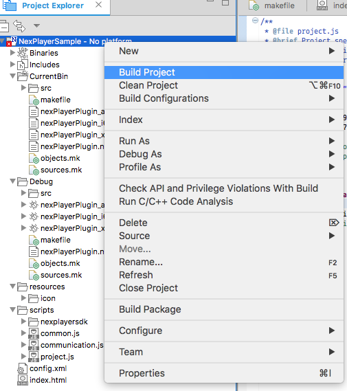

# Usage
##  How to integerate NexPlayer Tizen SDK 

This document describes the integration of the NexPlayer Tizen SDK and the detailed steps
to create a sample application.


## Prerequisites 

### Setting Environment

1. Download and Install the Tizen Studio IDE from this [link](http://developer.samsung.com/tv/develop/tools/tizen-studio/). Make sure to select the appropriate Operating System 


2. Install the Tizen TV SDK from [here]( http://developer.samsung.com/tv/develop/tools/tv-extension/download).


3. Configure the Tizen TV Emulator. Go to Tools-->Emulator Manager. Click on Create button and follow the instructions in the screen. The default settings can be keept.


4. The Tizen certification is required to run a package on the Emulator or on a real-device. Click on Tools-->Package Manager to obtain it.
Follow [this](http://developer.samsung.com/gear/develop/getting-certificates/manage) guide to see all the steps.

------

## How to create a simple Tizen TV application using NexPlayer Tizen SDK

### Create a Basic Project using Tizen Studio

1. Create a new project using  _Tizen Project Wizard_. Click on File -> New -> Other. 
You can also click the new Icon in Tizen Studio to start the wizard.  


2. Select the type of the project Under Tizen -> Samsung TV as Tizen NACL App (C/C++) and click _Next_.  


3. In this step, you can set basic properties of the project such as name, folder, language and toolchain. Click _Next_.  


4. Select Empty project and click on _Next_.  


5. Finally Select Widget Configuration. Change them according to your needs or leave as they come by default


6. Then you can see the following directory structure, Tizen Studio has created a boilerplate code for us. 
In the next section, you will start integrating the NexPlayer Tizen SDK.  


7. At this point you can Build Project, Build Package and Run it as a Widget App by right clicking the Project main folder. You should build the project to continue the process.


### Integrate NexPlayer SDK in the sample app

1. Since we are going to add already compiled `.nexe` files to the sample project. 
We should remove the unnecessary files from our project. Remove the file in `src` folder and the
 `.nexe` and `.nmf` files form the CurrentBin folder.
> The name of the files will have the `NexPlayerSample` prefix

2. Copy the NexPlayer Tizen SDK files to the sample project.
    - Copy the _nexplayersdk_ folder that contains the javascript files
     to the *NexPlayerSample/Scripts* folder.
    - Copy the _nexPlayerPlugin_armv7.nexe_,
    the _nexPlayerPlugin_i686.nexe_, the _nexPlayerPlugin_x86-64.nexe_ and the _nexPlayrPlugin.nmf_ to *NexPlayerSample/CurrentBin* folder

3. You have to replace the contents of the `index.html` file. First of all, add the links to the nexplayersdk script files at the `HEAD` tag.  
```html
  <script type="text/javascript" src="scripts/nexplayersdk/nexPlayer.js"></script>
  <script type="text/javascript" src="scripts/nexplayersdk/nexCaptionRenderer.js"></script>
  <script type="text/javascript" src="scripts/nexplayersdk/nexNaclModule.js"></script>
  <script type="text/javascript" src="scripts/nexplayersdk/nexErrorValue.js"></script>
```

4. Add the following code inside `<body></body>` tags in  `index.html` file.  
```html
<div id="listener">
  <!-- NaCl module will be attached inside this div element by a function 
  defined in nexNaclModule.js after "DOMContentLoaded" event occurs. -->

  <div id="caption-window">
    <!-- captions will be attached inside this div element by a function 
    defined in nexCaptionRenderer.js during media playback -->
  </div>
</div>
```

5. The next step is to add the Javascript code to initialize the player and the NACL module.
Replace the contents of file `common.js` file in the Scripts folder with the following code.  

  ```javascript   
  var sample_url = 'https://devimages.apple.com.edgekey.net/streaming/examples/bipbop_16x9/bipbop_16x9_variant.m3u8';

  var nexplayer = null;
  var nmf_path_name = 'CurrentBin/nexPlayerPlugin.nmf';

  /**
  * Print message in the logs area if it has a specific prefix (defined in 
  * kLogPrefix or kErrorPrefix).
  * @param message - a string message
  * @returns true - if this message was a log or error message. 
  */
  function printIfLog(message) {
    logs.value += message;
    logs.scrollTop = logs.scrollHeight;
    return true;
  }

  function onStatusReport(message, value) {
    if (message === StatusReportMessage.kStatusChanged) {
        var log = 'Status changed:' + value + '\n';
        printIfLog(log);
        if (value === NexPlayerStatus.OPEN) {
          // media open completed.
          // you can play media.
          nexplayer.play();
        }
    } else if (message === StatusReportMessage.kAsyncCompleted) {
        if (value === ActionEnum.kSeek) {
          printIfLog('Seek Async Command Completed \n');
        } else {
          printIfLog(' Async Command Completed \n');
        }
    } else if (message === StatusReportMessage.kTrackChanged) {
        printIfLog('Track Changed \n');
    } else if (message === StatusReportMessage.kContentInfoUpdated) {
        printIfLog('total duration:' + value.duration);
    }
  }

  function onErrorOccured(error) {
      var errorValue = getNexPlayerError(error);
      var  errorMessage = "Error Occured:" + errorValue.toString();
  }

  function onEndOfContent() {
    printIfLog("Playback is completed");
  }

  function initPlayerEventListener() {
    var playerListener = {};
    playerListener.onBufferingStart = function() {

    };    
    playerListener.onBufferingComplete = function() {

    };
    playerListener.onChangeRepresentation = function(type, id) {
        var mediaChangedMessage;
        if (type === StreamTypeEnum.kAudio)
          mediaChangedMessage = 'audio stream changed index:' + id;
        else if (type === StreamTypeEnum.kVideo)
          mediaChangedMessage = 'video stream changed index:' + id;
        else if (type === StreamTypeEnum.kSubtitles)
          mediaChangedMessage = 'text stream changed index:' + id;
    };
    playerListener.onUpdateTime = function (time) {
      var current_time = parseFloat(time);
    };
    playerListener.onStatusReport = onStatusReport;
    playerListener.onError = onErrorOccured;
    playerListener.onEndOfContent = onEndOfContent;
    return playerListener;
  }

  function onNaclModuleLoad() {
    printIfLog("LOG: handleNaclLoad");

    nexplayer.addEventListener(initPlayerEventListener());
    nexplayer.init(sample_url);
    nexplayer.load();
  }

  function onNaclModuleCrash(exitStatus) {
    printIfLog("LOG: Crashed/exited with status: " + exitStatus);
  }

  /**
  * Configure this page with project specific elements when document finishes
  * loading.
  */
  document.addEventListener("DOMContentLoaded", function() {
    printIfLog("LOG: DOMContentLoaded!");
    var listenerDiv = document.getElementById("listener");

    NexNaCl.printIfLog = printIfLog;
    NexNaCl.eventListener = new NaclEventListener(onNaclModuleLoad, onNaclModuleCrash);
    NexNaCl.createNaclModule(nmf_path_name, listenerDiv, '100%', '100%');
    nexplayer = NexNaCl.nexplayer;
    NexNaCl.nexcaption.setCaptionElementId('caption-window');
  });

  ```

7. For running the Sample App on TV, You will need to add the privileges through the Tizen IDE.
Right click on the Project name and then select properties. In the Tizen Studio menu, click on Tizen 
privileges.

Make sure to select the following ones and click on apply.

  ```xml
  <tizen:privilege name="http://tizen.org/privilege/filesystem.read"/>
  <tizen:privilege name="http://tizen.org/privilege/filesystem.write"/>
  <tizen:privilege name="http://tizen.org/privilege/tv.inputdevice"/>
  <tizen:privilege name="http://developer.samsung.com/privilege/network.public"/>
  <tizen:privilege name="http://developer.samsung.com/privilege/productinfo"/>
  <tizen:privilege name="http://developer.samsung.com/privilege/contentsdownload"/>
  <tizen:privilege name="http://developer.samsung.com/privilege/contentsinfo"/>
  <!-- to use drm -->
  <tizen:privilege name="http://developer.samsung.com/privilege/drminfo"/>
  <tizen:privilege name="http://developer.samsung.com/privilege/drmplay"/>
  ```

8. Change the Build Artifact name of the Project properties. Right click on the Project name and then select properties. Modify the Artifact name to `nexPlayerPlugin`.


9. Make sure that the current directory structure looks like below   


For more documementation and help check [this](http://developer.samsung.com/tv/develop/extension-libraries/nacl/how-to-create-a-nacl-app)
 guide on Samsung Developers site

### Building and Running the Project

1. Right click on the project name and click on _Build Project_  


2. To create a widget, right click on the project name and click _Build Package_.

3. At this point you can run the sample app on TV and test it.

To launch the project on Smart TV Emulator or Tizen TV Check [this](http://developer.samsung.com/tv/develop/extension-libraries/nacl/ide/launching-a-nacl-project-from-ide)
 guide.

For more documentation about packaging and widgets check [this](http://developer.samsung.com/tv/develop/extension-libraries/nacl/ide/exporting-a-nacl-project-to-a-widget-in-ide)
 guide.